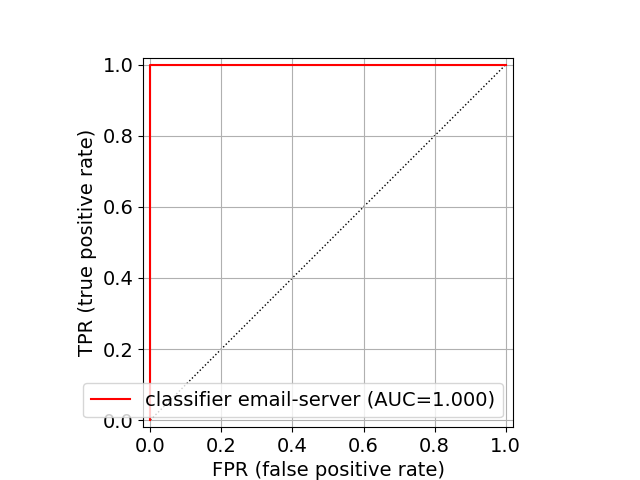
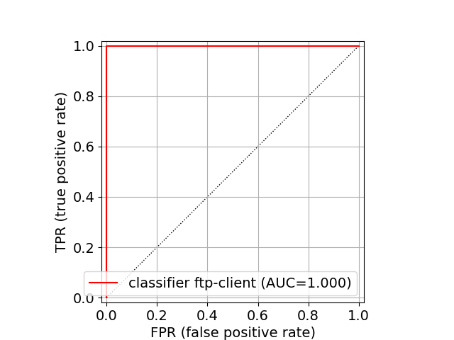
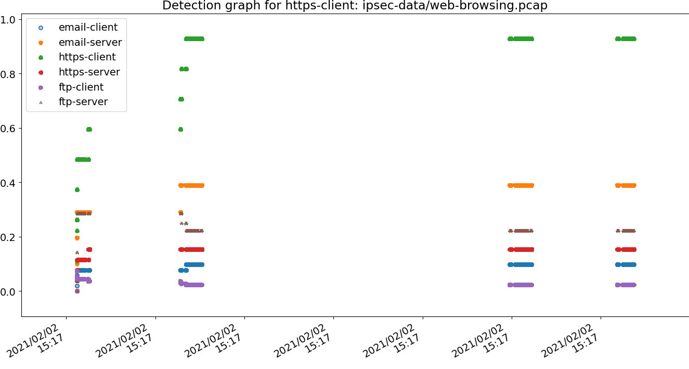
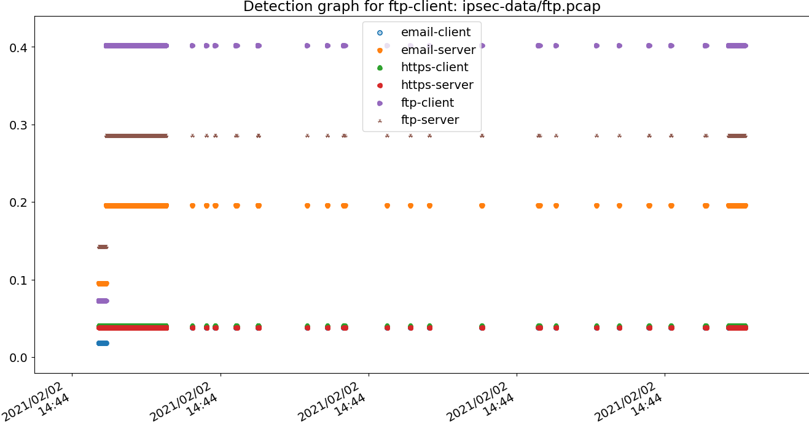

The following report describes the test and evaluation of the
following datasets:

Evaluation Parameter     Value
--------------------     -----------------------------
**Classifier algorithm** *lms*
**Training files**       6
**Test files**           6
**Processors used**      8
**Processing time**      0.0976 minutes
**Result AUC**           0.8444

# Result summary

## Summarized training results

Training analysis estimates the difference in fingerprinting the
various protocols in the chart below, where a lighter color (yellow)
represents greater diversity between the protocols and easier to
identify against the corresponding.

## Summarized test evaluation results

Evaluation results, with blue indicating good (true-positives) and red
indicating false positive rates.  These results are likely more
accurate than the estimated similarity above.

The ROC curve for these test results:

## Measured Classifier Precisions

Classifier                                tp  fp Precision
---------------------------------------- --- --- ---------
email-client                               1   1 0.5000
email-server                               1   0 1.0000
https-client                               1   0 1.0000
https-server                               1   0 1.0000
ftp-client                                 1   0 1.0000

## Individual Classifier ROCs

### Classifier ROC: email-client

### Classifier ROC: email-server

### Classifier ROC: https-client

### Classifier ROC: https-server

### Classifier ROC: ftp-client

# Detailed test results

The following section describes each test case and whether the
classification model successfully identified the traffic in question.
Each file below contains a graph showing the detection
pseudo-confidence between 0.0 and 1.0, along with the classifier
confidence scores per flow-identifier within the traffic observed.

##  Test 1: email-client traffic

* File: ipsec-data/email-smtp.pcap
    * Filtered applied: esp and src 10.0.3.2
    * Packets processed: 1400
* Traffic label: email-client

* Processing time: 0.0107 minutes

### Flows identified:

-  flow identifier: (50, '10.0.3.2', '10.0.6.2')
    - Total packets: 1400

    Label                                    Score
    ---------------------------------------- --------
    email-client                             0.7169
    https-server                             0.3331
    email-server                             0.2185
    ftp-server                               0.1667
    https-client                             0.0934
    ftp-client                               0.0613

##  Test 2: email-server traffic

* File: ipsec-data/email-smtp.pcap
    * Filtered applied: esp and src 10.0.6.2
    * Packets processed: 1400
* Traffic label: email-server

* Processing time: 0.0087 minutes

### Flows identified:

-  flow identifier: (50, '10.0.6.2', '10.0.3.2')
    - Total packets: 1400

    Label                                    Score
    ---------------------------------------- --------
    email-server                             0.9857
    ftp-server                               0.5000
    https-client                             0.3361
    email-client                             0.1573
    https-server                             0.1537
    ftp-client                               0.1205

##  Test 3: https-client traffic

* File: ipsec-data/web-browsing.pcap
    * Filtered applied: esp and src 10.0.3.2
    * Packets processed: 1400
* Traffic label: https-client

* Processing time: 0.0079 minutes

### Flows identified:

-  flow identifier: (50, '10.0.3.2', '10.0.6.2')
    - Total packets: 1400

    Label                                    Score
    ---------------------------------------- --------
    https-client                             0.9286
    email-server                             0.3898
    ftp-server                               0.2222
    https-server                             0.1537
    email-client                             0.0976
    ftp-client                               0.0243

##  Test 4: https-server traffic

* File: ipsec-data/web-browsing.pcap
    * Filtered applied: esp and src 10.0.6.2
    * Packets processed: 1400
* Traffic label: https-server

* Processing time: 0.0120 minutes

### Flows identified:

-  flow identifier: (50, '10.0.6.2', '10.0.3.2')
    - Total packets: 1400

    Label                                    Score
    ---------------------------------------- --------
    https-server                             0.9806
    email-client                             0.3772
    ftp-server                               0.1542
    email-server                             0.1493
    https-client                             0.1293
    ftp-client                               0.0469

##  Test 5: ftp-client traffic

* File: ipsec-data/ftp.pcap
    * Filtered applied: esp and src 10.0.3.2
    * Packets processed: 1400
* Traffic label: ftp-client

* Processing time: 0.0038 minutes

### Flows identified:

-  flow identifier: (50, '10.0.3.2', '10.0.6.2')
    - Total packets: 1400

    Label                                    Score
    ---------------------------------------- --------
    ftp-client                               0.4018
    ftp-server                               0.2857
    email-server                             0.1954
    https-client                             0.0407
    https-server                             0.0383
    email-client                             0.0380

##  Test 6: ftp-server traffic

* File: ipsec-data/ftp.pcap
    * Filtered applied: esp and src 10.0.6.2
    * Packets processed: 1400
* Traffic label: ftp-server

* Processing time: 0.0043 minutes

### Flows identified:

-  flow identifier: (50, '10.0.6.2', '10.0.3.2')
    - Total packets: 1400

    Label                                    Score
    ---------------------------------------- --------
    email-client                             0.0200
    https-server                             0.0195
    ftp-server                               0.0012
    email-server                             0.0000
    https-client                             0.0000
    ftp-client                               0.0000
