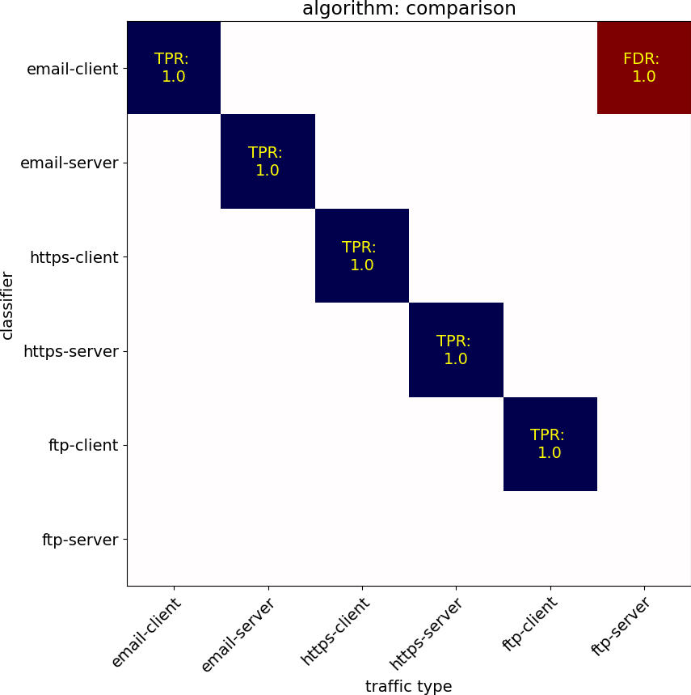
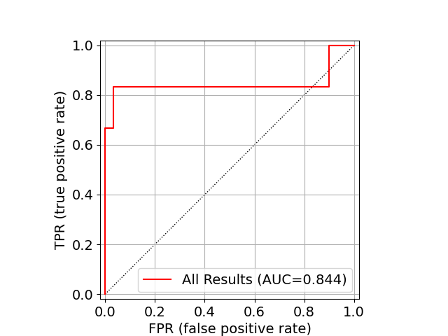

The following report describes the test and evaluation of the
following datasets:

Evaluation Parameter     Value
--------------------     -----------------------------
**Classifier algorithm** *{{algorithm_used}}*
**Training files**       {{training_results | length}}
**Test files**           {{test_results | length}}
**Processors used**      {{processes}}
**Processing time**      {{tande_time}} minutes
**Result AUC**           {{test_auc}}

# Result summary

## Summarized training results

Training analysis estimates the difference in fingerprinting the
various protocols in the chart below, where a lighter color (yellow)
represents greater diversity between the protocols and easier to
identify against the corresponding.

## Summarized test evaluation results

Evaluation results, with blue indicating good (true-positives) and red
indicating false positive rates.  These results are likely more
accurate than the estimated similarity above.

The ROC curve for these test results:

## Measured Classifier Precisions

{{"%-40s" | format("Classifier")}}  tp  fp Precision
---------------------------------------- --- --- ---------

{{"%-40s" | format(key)}} {{"%3d" | format(bytype_results[key]['good'])}} {{"%3d" | format(bytype_results[key]['bad'])}} {{"%0.4f" | format(bytype_results[key]['percent'])}}


## Individual Classifier ROCs



### Classifier ROC: {{classifier}}



# Detailed test results

The following section describes each test case and whether the
classification model successfully identified the traffic in question.
Each file below contains a graph showing the detection
pseudo-confidence between 0.0 and 1.0, along with the classifier
confidence scores per flow-identifier within the traffic observed.




##  Test {{loop.index}}: {{file['label']}} traffic

##  Test {{loop.index}}: {{file['label']}} traffic


* File: {{file['file']}}
    * Filtered applied: {{file['test_specification']['filter_applied']}} 
    * Packets processed: {{file['total_count']}}
* Traffic label: {{file['label']}}
    * Remapped label: {{file['mapped_label']}}
* Processing time: {{file['processing_time']}} minutes

### Flows identified:



-  flow identifier: {{identifier}}
    - Total packets: {{file['identifier_counts'][identifier]}}

    
    {{"%-40s" | format("Label")}} Score
    {{"%-40s" | format("----------------------------------------")}} --------
    
    {{"%-40s" | format(label)}} {{"%0.4f" | format(value)}}
    



