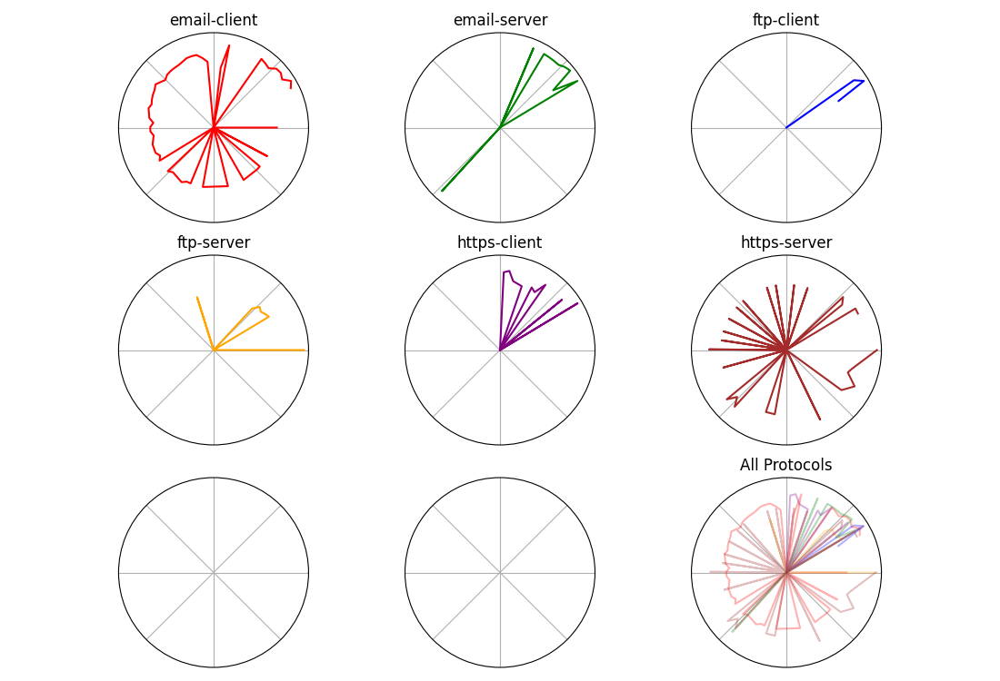

``gold-miner-fingerprint``: builds a visual training profile image
---------------------------------------------------------------------

**IMPORTANT: this page describes the `gold-mine-fingerprint` tool that is
part of the ``gold-miner-ui`` python package, which is distributed
separately from the ``gold-miner`` python package**

The ``gold-miner-fingerprint`` tool takes a profile created by the
gold-miner-trainer-aggregator_ tool and produces a graphical
representation of it.  The representation is design to visually show
the differences in the profiles with more similar patterns being
potentially harder to discern between compare to significantly
different fingerprints.

.. _gold-miner-trainer-aggregator: goldminertraineraggregator.html

Example Invocation
^^^^^^^^^^^^^^^^^^^^

::

   gold-miner-fingerprint training-profile.fsdb fingerprint.png

Command Line Arguments
^^^^^^^^^^^^^^^^^^^^^^

.. sphinx_argparse_cli::
   :module: apropos.goldminer.tools.fingerprinter
   :func: parse_args
   :hook:
   :prog: introduction
